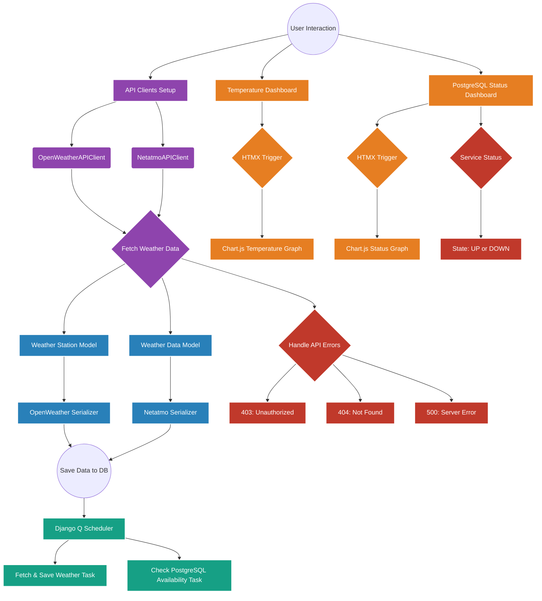

# Design Patterns in Django Weather Monitoring Application

## 🌟 Project Overview

The goal of the project was to develop a Django system to **monitor meteorological data and the status of a PostgreSQL service**. The system integrates:

- **Asynchronous API clients** to collect data from **OpenWeather** and **Netatmo**
- **Live dashboard** to display temperatures and database availability
- **Scheduler for periodic tasks** using **Django Q**
- **HTMX** for live updates without reloading the page

The project is structured according to **design principles** studied during the learning process, based on the Packt-published book [Mastering Python Design Patterns](https://www.packtpub.com/en-us/product/mastering-python-design-patterns-9781837639618), with **Django** as the foundation and **Chart.js** for dynamic charts. Among other principles, emphasis was placed on applying "Encapsulate What Varies," "Program to an Interface, Not an Implementation," and "Strive for Loosely Coupled Designs Between Objects."

**Disclaimer:**  
During the development of this project, I used **Generative AI tools** as a learning aid, primarily treating AI as a tutor. Asking the right questions helped me validate my understanding, even though the responses were not always complete or entirely accurate, in my opinion.

As a native Italian speaker, you may occasionally find some code comments in Italian. I plan to translate them into English at a later stage.

## Architectural Overview

The application follows Django's Model-View-Template (MVT) pattern, which is Django's adaptation of the classic Model-View-Controller (MVC) pattern, which ensures the decoupling between components by desing. The codebase demonstrates thoughtful architecture with proper separation of concerns and several established design patterns.

## Design Patterns Identified

### 1. Adapter Pattern

**Implementation:** `OpenWeatherSerializer` and `NetatmoSerializer`

The Adapter pattern converts the interface of a class into another interface clients expect. This pattern is heavily used in the serializers to adapt different API response formats (OpenWeather and Netatmo) to a consistent model structure.

```python
class OpenWeatherSerializer(serializers.ModelSerializer):
    # ...
    field_mapping = {
        "temperature": "main.temp",
        "feels_like": "main.feels_like",
        "humidity": "main.humidity",
        # ...
    }

    def to_internal_value(self, data):
        """Maps OpenWeather JSON fields to Django fields."""
        mapped_data = {key: self.get_nested_value(data, path) for key, path in self.field_mapping.items()}
        # ...
```

```python
class NetatmoSerializer(serializers.ModelSerializer):
    # ...
    field_mapping = {
        "longitude": "place.location[0]",
        "latitude": "place.location[1]",
        "city": "place.city",
        # ...
    }
```

Here, both serializers adapt different JSON structures to fit the same `WeatherData` and `WeatherStation` models. The `field_mapping` dictionaries define how to map source fields to destination fields.

### 2. Strategy Pattern

**Implementation:** Weather API clients

The Strategy pattern defines a family of algorithms, encapsulates each one, and makes them interchangeable. The application uses this pattern with different API clients (OpenWeather and Netatmo) that share a common interface.

Evidence in `views.py`:

```python
if "openweather_submit" in request.POST:
    # ...
    client = OpenWeatherAPIClient()
elif "netatmo_submit" in request.POST:
    # ...
    client = NetatmoAPIClient()

result = await fetch_and_save_weather(client, **params)  # async method
```

The `fetch_and_save_weather` function accepts any client that adheres to the expected interface, allowing different strategies for retrieving weather data.

### 3. Factory Method Pattern

**Implementation:** Serializer selection in `fetch_and_save_weather`

The Factory Method pattern creates objects without specifying the exact class to be created. This pattern is used when deciding which serializer to use:

```python
def fetch_and_save_weather(api_client, **kwargs):
    # ...
    serializers = []
    if api_client.source == "openweather":
        serializers.append(OpenWeatherSerializer(data=json_data))
    elif api_client.source == "netatmo":
        for station in json.loads(json_data).get("body", []):
            serializers.append(NetatmoSerializer(data=station))
    else:
        raise ValueError("Invalid source")
```

Here, the function acts as a factory, creating the appropriate serializer type based on the API client source.

### 4. Observer Pattern

**Implementation:** HTMX-driven dashboard updates

The Observer pattern allows objects to notify other objects about changes in their state. This pattern is implemented through HTMX for real-time dashboard updates:

```html
<div
  id="postgres-status-container"
  hx-get=""
  hx-trigger="every 10s"
  hx-swap="outerHTML"
></div>
```

```html
<div
  id="temperature-data"
  hx-get=""
  hx-trigger="load, every 30s"
  hx-swap="outerHTML"
  hx-include="#station-form, #interval-select"
></div>
```

The dashboards automatically observe changes in the database and refresh themselves periodically, implementing a web-based version of the Observer pattern.

### 5. Decorator Pattern

**Implementation:** Function timing decorator

The Decorator pattern dynamically adds responsibilities to objects. This is implemented with the `log_function_call_with_timing` decorator:

```python
def log_function_call_with_timing(func):
    def wrapper(*args, **kwargs):
        start_time = time.time()
        logging.info(
            f"{now()} - Calling function: {func.__name__} with arguments: {args} and keyword arguments: {kwargs}"
        )
        result = func(*args, **kwargs)
        end_time = time.time()
        execution_time = end_time - start_time
        logging.info(f"Function: {func.__name__} returned: {result} (Execution time: {execution_time:.4f} seconds)")
        return result

    return wrapper
```

This decorator adds timing and logging functionality to any function it decorates without modifying the original function's code.

### 6. Command Pattern

**Implementation:** Asynchronous task execution

The Command pattern encapsulates a request as an object, allowing for parameterizing clients with different requests and queue/log requests. This pattern is evident in the use of async tasks:

```python
async def fetch_and_save_weather(api_client, **kwargs):
    # ...
    coros = []
    for serializer in serializers:
        coros.append(save_serializer(serializer))
    results = await asyncio.gather(*coros)
    # ...
```

The application creates command objects (coroutines) that are executed later with `asyncio.gather()`.

### 7. Proxy Pattern

**Implementation:** Django's ORM in models and views

While Django's ORM implements this pattern automatically, the application clearly uses it to abstract data access:

```python
logs = PostgresStatusLog.objects.filter(timestamp__gte=now() - time_range).order_by("-timestamp")
```

```python
station, _ = WeatherStation.objects.get_or_create(**station_data)
```

The Proxy pattern abstracts data access to provide a more object-oriented view of the persistence layer.

### 8. Bridge Pattern

**Implementation:** Service layer between views and models

The Bridge pattern decouples an abstraction from its implementation. The `services.py` file acts as a bridge between views and data access:

```python
async def fetch_and_save_weather(api_client, **kwargs):
    # ...
    json_data = await api_client.get_weather_data(**kwargs)
    # ... process data ...
    results = await asyncio.gather(*coros)
    # ... return response ...
```

This service layer abstracts the complexity of fetching and saving weather data, separating the high-level logic (in views) from its implementation.

## Conclusion

The Django weather monitoring application demonstrates sophisticated use of design patterns to create a maintainable, extensible, and efficient architecture. Key strengths include:

1. **Adaptability**: The application can easily incorporate additional weather data sources by creating new adapters.
2. **Separation of concerns**: Clear boundaries between data access, business logic, and presentation.
3. **Code reuse**: Through proper abstraction and patterns like Command and Decorator.
4. **Asynchronous design**: Leveraging modern Python's async capabilities for responsive UI and efficient API calls.

## Diagrams


